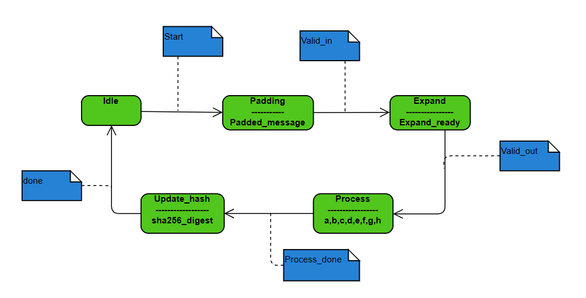

Secure Hash Algorithm 256 bits (SHA-256)
========================================

It is a **cryptographic hash function** that allows us to generate a **256-bit (32-byte)** string from any input size. It is part of the **SHA-2** family of functions.

some features:

*   The **output** length is always **256 bits**.
    
*   It is much **more secure** than **SHA-1** and **MD5**.
    
*   It is **faster than SHA-512** but less secure. This is because SHA-512 generates a 512-bit string, making it more secure but slower in communication. Nevertheless, the security provided by SHA-256 is quite high.
    

Before presenting the pseudocode, I will explain the SHA-256 function step by step.

First, we receive the message and perform the **padding** process. In this stage, the message is padded until it reaches a length that is a multiple of 512 bits. Once the **padding** is complete, we move to the **expand state**, where the padded message is divided into 512-bit blocks. Each block is then broken down into **16 words of 32 bits**, which we will call w\_j\[i\] (where i is the index of the word within block j).

From these 16 words, we apply a specific expansion algorithm to generate the **remaining 49 words**, thus obtaining a total of **64 words of 32 bits per block**.

Once the expansion is complete, we move to the **process** state, where the **registers** are initialized with the **initial hash values**. These values are well-known constants derived from the **truncated square roots of the first eight prime numbers**.

In this stage, a series of **iterations** are executed to update the registers. Once the iterations are complete, the register values are updated with the new hash values.

If the message contains **more than one block**, they must be processed in **order**, from the **first to the last**. This is crucial because **each block will use the hash values computed in the previous block as its initial values**.

Finally, in the **Hash\_update** state, we concatenate the obtained hash values to generate the **final hash** of the message, which will have a length of **256 bits**.

Pseudocódigo
------------

*   SHA256\_digest
    
    ```java
    SHA256_digest(message_in, message_len[255:0])
      //The message of n bytes and its length are received; it can have any length.
    
      //variable buffer_size controlamos la parte que queremos usar del buffer de tamaño fijo de 1536 bits
      if message_len < 447 
        buffer_size = 512
      else if message_len < 959
        buffer_size = 1024
      else
        buffer_size = 1536
     
      //Call the package and the process
      for j from 0 to N-1 do:
        buffer[j] <- Padding(message_in[j])    // buffer[N][]
        w_j <- Expand(buffer[j])
      H <- H_0   // init H
      for j from 0 to N-1:
        H <- Process(w_j, H)
    return H
    ```
    
    *   sha256\_pkg
        
        ```java
        //Package of function and constant
        
        //Initialize the hash values 
        //(first 32 bits of the fractional parts of the square roots of the first 8 primes 2..19)
        
        H[i] = 32'h6a09e667, 32'hbb67ae85, 32'h3c6ef372,
            32'ha54ff53a, 32'h510e527f, 32'h9b05688c,
            32'h1f83d9ab, 32'h5be0cd19
            
        //Initialize the array of 64 constants K of 32 bits
        //first 32 bits of the fractional parts of the cube roots of the first 64 primes 2..311
        
        K[64:0] = 32'h428a2f98, 32'h71374491, 32'hb5c0fbcf, 32'he9b5dba5,
                ....
                 32'h90befffa, 32'ha4506ceb, 32'hbef9a3f7, 32'hc67178f2
        
        //We define the right rotation functions (rotr)
        Start function rotr <- rotr(x,n)
          (x >>n) | (x << (32-n))
        End function
        
        //We defined the expand functions (sigma_0, sigma_1) and compresion (Sigma_0, Sigma_1, Choose (Ch) and Majority(Maj))
        
        Start function sigma_0 <- sigma_0(x)
          sigma_0  =   rotr(x, 7) XOR rotr(x, 18) XOR (x >> 3)
        End function
        
        Start function sigma_1 <- sigma_1(x)
          sigma_1  =   rotr(x, 17) XOR rotr(x, 19) XOR (x >> 10)
        End function
        
        Start function Sigma_1 <- Sigma_1(x)
          Sigma_1  =   rotr(x, 2) XOR rotr(x, 13) XOR rotr(x, 22)
        End function
        
        Start function Sigma_2 <- Sigma_2(x)
          Sigma_2  =   rotr(x, 6) XOR rotr(x, 11) XOR rotr(x, 25)
        End function
        
        Start function Ch <- Ch(x,y,z)
          Ch  = (x & y) XOR (~x & z)
        End function
        
        Start function Maj <- Maj(x,y,z)
          Maj = (x & y) XOR (x & z) XOR (y & z)
        End function
        ```
        
    *   Padding ()
        
        ```java
        //With the message fully received, we start with the Padding.
        
        Start function buffer_main <- Padding(buffer_main, message_len)
        
          append '1' bits  //At the end of the message
          append k bits of '0'  //until the condition is met (message_len + 1 + k +64) be a multiple of 524, with the smallest possible number
          append message_lens as a 64-bit big-endian integer
        
        End function
        ```
        
    *   Expand ()
        
        ```java
        Start function w_j <- Expand(buffer_main)
        
          //We divide the bit string into blocks of 512 bits each.
          //N is the number of blocks obtained
        
          for j to N do
            We create an array of 64 elements of 32 bits per word w[63:0].
            We store the first 16 32-bit words w[0..15] which gives us a 512-bit block.
            //Now we extend the 16 words to the rest of the array with
            for i from 16 to 63 do
              w_j[i] = sigma_0(w_j[i-15]) + w_j[i-16] +sigma_1(w_j[i-2]) + w_j[i-7]  
            end for
          end for
        
        End function
        ```
        
    *   Process ()
        
        ```java
        H[0], H[1], H[2], H[3], H[4], H[5], H[6], H[7] <- Process(w_j)
        
          for j to N do
            //First we initialize the registers
            a,b,c,d,e,f,g,h = H[0],H[1],H[2],H[3],H[4],H[5],H[6],H[7]
        
            //Then we start the calculation of the registers
            for t from 0 to 63 do
              T1 = h + Sigma_1(e) + Ch(e,f,g) + k[t] + w[t]
              T2 = Sigma_0(a) + Maj(a,b,c)
              h = g
              g = f
              f = e
              e = d + T1
              d = c
              c = b
              b = a
              a = T1 + T2
            end for
          
            //We define the recurrence relation for the i-th value of the hash h^i
            H[0]^(i) = a + H[0]^(i-1)
            H[1]^(i) = b + H[1]^(i-1)
            H[2]^(i) = c + H[2]^(i-1)
            H[3]^(i) = d + H[3]^(i-1)
            H[4]^(i) = e + H[4]^(i-1)
            H[5]^(i) = f + H[5]^(i-1)
            H[6]^(i) = g + H[6]^(i-1)
            H[7]^(i) = h + H[7]^(i-1)
          end for
        
        End function
        ```
        
    *   Hash\_update()
        
        ```java
        hash256_digest <- Hash_update(H[0], H[1], H[2], H[3], H[4], H[5], H[6], H[7])
        
          //Finally, once the value of the N-enesimo hash has been calculated (N for the number of blocks that have been divided), we concatenate the values to obtain the value of the final hash
          hash256_digest [255:0] = H[0] append H[1] append H[2] append H[3] append H[4] append H[5] append H[6] append H[7]
        
        End function
        ```
        

Variables/operations analysis
-----------------------------

*   **Input signals**
    
    *   The input signal `message_in` has a size of **8 bits** to input the message in parts.
        
    *   The input signal `message_len` has a size of **256 bits** in order to **store the total size** of the message in bits.
        
*   **Output signals**
    
    *   The sha256\_digest output signal has a size of **256 bits** in order to store the SHA256 result.
        

To receive the message, we use a **512-bit buffer** that will be receiving the message in **8-bit chunks**. Once the message is complete or fully received, the **information is stored** in a **buffer** called `block_1`, after which the buffer is cleared, and receiving continues. A **minimum of 3 blocks** will be needed to fully receive messages from **EDHOC.** By reading the code at line 36 in the GitHub repository ([https://github.com/openwsn-berkeley/lakers/blob/main/shared/src/lib.rs](https://github.com/openwsn-berkeley/lakers/blob/main/shared/src/lib.rs) ), we can see that the **maximum possible message length is 1024 bits**, meaning we will need three blocks to receive the message without any issues.

*   Padding function:
    
    *   To know the number of blocks needed `message_len` must meet the following conditions:
        
        *   If `message_len <447 bits`, a single block will be used
            
        *   If `447 < message_len < 959 bits`, two blocks will be used
            
        *   If `959 < message_len < 1471 bits`, three blocks will be used
            
*   Expand function
    
    *   The **for** loop on line 10 calculates the **remaining 48 words of 32 bits** for a block, while the **for** loop on line 6 applies this process to **all the blocks.**
        
        This calculation can be **parallelized**, as each word generated is **independent of other blocks**. Additionally, it is possible to implement a **pipeline-type parallelization**, allowing the words of **two blocks to be calculated simultaneously**, thereby optimizing performance.
        
*   Process function
    
    *   The **loop** starting at line 1 indicates that the **entire Process** state will be calculated for **each 512-bit block**.
        
    *   The registers **a,b,c,d,e,f,g,h** are **32-bit variables each**. Initially, these registers are assigned the **values of the truncated square roots of the first eight prime numbers**. These **constants** are defined in line 6 of the `sha256_pkg` package. However, when processing more than one block, the values of these registers are **updated at the end of each iteration**, using the **result of the previous block** as new input.
        
    *   Since the values of the **registers depend** on the calculations made in the **previous** block, it is **not possible to parallelize this process.**
        
    *   The **loop at line 6** defines the logic for updating the registers. Since each iteration depends on the previous one, this process **cannot be parallelized** either.
        
*   Hash\_update function
    
    *   Once all the values of the registers have been calculated and assigned to the constants **H\[i\]**, we concatenate them in the **output signal sha256\_digest**.
        

Finite State Machine SHA 256
----------------------------

*  
    
    *   In the **Idle** state, the machine is **waiting** to receive a message.
        
    *   In the **Padding** state, the message is stored in a buffer and padded with a **1 bit followed by zeros**. Additionally, the original **length of the message is added at the end of the buffer as a 64-bit word**.
        
    *   In the **Expand** state, the buffer (after going through the Padding process) is **divided into 512-bit blocks**. Then, **each block is subdivided into 16 words of 32 bits**, which are used to calculate **the remaining 48 words** through an expansion process. As a result, **each block must contain a total of 64 words of 32 bits**.
        
    *   In the **Process** state, the hash calculation is performed. First, the registers are initialized, assigning them the values of the constants **H\[i\]**. Then, these values are updated 64 times throughout the process.
        
        Once the update is complete, the values obtained from the registers are added to the constants **H\[i\]**. If there is more than one block, the process is repeated for the next one, applying the same procedure.
        
    *   In the **Hash\_update** state, all the values obtained are **concatenated into a 256-bit array**, which represents the **final hash** of the received message.
        

Series block diagram
--------------------

*   
    
    **Serial block diagram** of the **Sha 256** process. We see the inputs, **Message\_in and Message\_len**, and the output, **SHA256\_digest**. The entire process shown is for only one message received.
    

Data-Flow Diagram (DFM) SHA256
------------------------------

*   
    

Scheduling Diagrams
-------------------

*   SHA256
    
    *   
        
    *   We can observe that it is possible to **receive a new message** while the hash of a previous message is still being calculated. This is because, once the **Expand function** releases the **buffer** where the received message was stored, this buffer can be reused to process another message simultaneously.
        
*   Padding
    
    *   
        
    *   In the figure we can notice that the **Padding process** only occurs when the **message is received**. This state cannot be parallelized because we need the **buffer** where the message is received to be **unoccupied** and this happens at the end of the **Expand function**. This is the reason why there is that blank space between each padding.
        
*   Expand
    
    *   
        
    *   The figure shows the **separation of the buffer**, which contains the message with the padding applied, into **512-bit blocks**. Subsequently, for each block, the **additional 32-bit words** necessary for the expansion of the message must be **calculated**. This process is **highly parallelizable**, since the **words generated** within a block do **not depend on other blocks**, which allows taking advantage of a **pipeline structure**.
        
    
    *   
    *   The **for** loop is responsible for calculating the **32-bit words for a block**. Each iteration of the cycle represents one column in the message expansion. Since this **for** is inside an **always\_ff block**, all **additions** are performed within the **same clock cycle**. However, it is not possible to calculate a word ahead of time, since each value depends on the calculation of the previous word.
        
    *   
        
    *   In the case of **calculating two blocks in parallel** using a **pipeline** structure, the scheduling of the process allows the same **resources to be reused** for the **Sum1** and **Sum2** operations. While calculating these values for one block, the **same resources can be used simultaneously** to **obtain the words corresponding to the next block**. In this way, the use of the hardware is optimized, ensuring a continuous flow in the generation of w\_j\[i\] without interruptions.
        
*   Process
    
    *   
        
    *   The figure shows that the **process state** can only be **applied in blocks**, since it depends on the values of the constants **H\[i\]**, which are **updated** after processing **each block**. Due to this **sequential dependency**, it is **not possible to parallelize or implement a pipeline structure** in this state.
        
*   Update\_Hash
    
    *   The scheduling diagram of this state shows a **single process**, which consists of **storing** the values of **H\[i\]** in an output signal called **sha256\_digest**. These **values** correspond to the **results obtained after the execution of the process state**.
        

Procesos paralelizables
-----------------------

When the SHA-256 function is applied to a message larger than **447 bits**, its length is adjusted to a **multiple of 512 bits** after **padding**. In the **Expand state**, the message is divided into **512-bit blocks**, and from this point on, each block follows a series of steps until it reaches the **Update\_hash state**, where the **final hash** is generated.

When analyzing the **scheduling diagrams,** it can be seen that several processes can be **parallelized** to optimize the use of the card's resources. A first level of parallelism is found in data reception: it is possible to receive a **new message** **while another one is being processed**. However, this process is not completely simultaneous, since the first message must reach the **Process state** before freeing the input **buffer** for the next message.

Another parallelizable aspect is the **computation of words in the Expand state**. Since the words in a block do **not depend** **on other blocks**, it is possible to implement **pipeline-like parallelization** to speed up this stage.

On the other hand, the **Process state cannot** be parallelized, since the hash values used to initialize the registers depend on the computations performed in the **previous blocks.** This imposes a sequential dependency on the update of the final hash.

Testbench
---------

*   One of the ways to test the code is that we are going to use what is known as “**testvector**” are known messages and of which the hash corresponding to the message is known.
    
    *   A **24-bit** long testvector is “**abc**” whose output in hexadecimal is:
        
        *   `ba7816bf 8f01cfea 414140de 5dae2223 b00361a3 96177a9c b410ff61 f20015ad`
            
    *   A **448-bit** long testvector is “**abcdbcdecdefdefgefghfghighijhijkijkljklmklmnlmnomnopnopq**” whose hexadecimal output is:
        
        *   `248d6a61 d20638b8 e5c02693 0c3e6039 a33ce459 64ff2167 f6ecedd4 19db06c1`
            
*   Another way to test the design is to create a Python code that calculates the hash of any message with sha256 and checks step by step each part or state of our machine.
    

P256
====

AES
===
